# Telehealth Application Database Schema and Relationships

This document provides a detailed overview of the database schema for the rewritten telehealth application, including entity definitions, key fields, and relationships. The database is built on PostgreSQL, managed by Supabase.

## 1. Core Principles

*   **Normalization**: Minimize data redundancy and improve data integrity.
*   **Clarity**: Clear naming conventions for tables and columns.
*   **Scalability**: Design for efficient querying and future growth.
*   **Security**: Leverage PostgreSQL features and Supabase RLS for data protection.
*   **Auditability**: Include `created_at` and `updated_at` timestamps for most tables.

## 2. Entity-Relationship Diagram (High-Level)

```mermaid
erDiagram
    AUTH_USERS ||--o{ PROFILES : "has"
    PROFILES ||--o{ PATIENTS : "manages"
    PATIENTS ||--o{ ORDERS : "places"
    PATIENTS ||--o{ INVOICES : "receives"
    PATIENTS ||--o{ CONSULTATIONS : "attends"
    PATIENTS ||--o{ FORM_SUBMISSIONS : "submits"
    PATIENTS ||--o{ PATIENT_DOCUMENTS : "owns"
    PATIENTS ||--o{ ENHANCED_TELEHEALTH_FLOWS : "participates_in"
    PATIENTS ||--o{ MESSAGES : "sends/receives"
    PATIENTS ||--o{ PATIENT_TAGS : "has_tags"

    PROVIDERS ||--o{ CONSULTATIONS : "conducts"
    PROVIDERS ||--o{ MESSAGES : "sends/receives"

    PRODUCTS ||--o{ ORDER_ITEMS : "included_in"
    PRODUCTS ||--o{ PRODUCT_SUBSCRIPTION_MAPPINGS : "has_durations"
    PRODUCTS ||--o{ FLOW_RECOMMENDATIONS : "recommended"

    SUBSCRIPTION_PLANS ||--o{ SUBSCRIPTIONS : "has"
    SUBSCRIPTION_PLANS ||--o{ INVOICES : "references"

    DISCOUNTS ||--o{ INVOICES : "applies_to"

    ORDERS ||--o{ ORDER_ITEMS : "contains"
    ORDERS ||--o{ ORDER_RELATIONSHIPS : "related_to"
    ORDERS ||--o{ INVOICES : "generates"

    QUESTIONNAIRE ||--o{ QUESTIONNAIRE_VERSIONS : "has_version"
    QUESTIONNAIRE ||--o{ FORM_SUBMISSIONS : "uses"
    QUESTIONNAIRE ||--o{ CATEGORY_FORM_TEMPLATES : "linked_to"

    FORM_SUBMISSIONS ||--o{ AI_RECOMMENDATIONS : "genergenerates"

    CONSULTATIONS ||--o{ PROCESSED_TEMPLATES : "generates"
    CONSULTATIONS ||--o{ AI_RECOMMENDATIONS : "generates"
    CONSULTATIONS ||--o{ PATIENT_VIEWS : "generates"

    NOTE_TEMPLATES ||--o{ TEMPLATE_SECTIONS : "has"
    NOTE_TEMPLATES ||--o{ PROCESSED_TEMPLATES : "uses"

    CATEGORIES ||--o{ PRODUCTS : "categorizes"
    CATEGORIES ||--o{ CATEGORY_FORM_TEMPLATES : "links_to_forms"
    CATEGORIES ||--o{ CATEGORY_PRICING_RULES : "defines_pricing"
    CATEGORIES ||--o{ ENHANCED_TELEHEALTH_FLOWS : "initiates"

    ENHANCED_TELEHEALTH_FLOWS ||--o{ FLOW_RECOMMENDATIONS : "has"
    ENHANCED_TELEHEALTH_FLOWS ||--o{ FLOW_STATE_TRANSITIONS : "tracks"

    TAGS ||--o{ PATIENT_TAGS : "used_for"
    TAGS ||--o{ SESSION_TAGS : "used_for"

    MESSAGES ||--o{ CONVERSATIONS : "belongs_to"
    CONVERSATIONS ||--o{ CONVERSATION_PARTICIPANTS : "has"

    AUDIT_LOGS }|--|| AUTH_USERS : "recorded_by"

    PRODUCT_RECOMMENDATION_RULES ||--o{ ORDER_ITEMS : "influences"
```

## 3. Detailed Table Definitions

### 3.1. `auth.users` (Supabase Managed)

*   **Description**: Core authentication table managed by Supabase.
*   **Key Fields**: `id` (UUID, PK), `email`, `phone`, `created_at`, `last_sign_in_at`.

### 3.2. `profiles`

*   **Description**: Extends `auth.users` with application-specific user profiles.
*   **Fields**:
    *   `id` (UUID, PK, FK to `auth.users.id`)
    *   `full_name` (TEXT)
    *   `avatar_url` (TEXT)
    *   `role` (TEXT, e.g., 'admin', 'patient', 'staff')
    *   `created_at` (TIMESTAMPTZ)
    *   `updated_at` (TIMESTAMPTZ)

### 3.3. `patients`

*   **Description**: Stores detailed patient information.
*   **Fields**:
    *   `id` (UUID, PK, FK to `auth.users.id`)
    *   `first_name` (TEXT)
    *   `last_name` (TEXT)
    *   `email` (TEXT, UNIQUE)
    *   `phone` (TEXT)
    *   `date_of_birth` (DATE)
    *   `gender` (TEXT)
    *   `address` (TEXT)
    *   `city` (TEXT)
    *   `state` (TEXT)
    *   `zip_code` (TEXT)
    *   `status` (TEXT, e.g., 'active', 'inactive', 'onboarding')
    *   `created_at` (TIMESTAMPTZ)
    *   `updated_at` (TIMESTAMPTZ)
    *   `metadata` (JSONB) - for flexible additional data
*   **Relationships**:
    *   One-to-one with `auth.users` (via `id`).
    *   One-to-many with `orders`, `invoices`, `consultations`, `form_submissions`, `patient_documents`, `enhanced_telehealth_flows`, `messages`, `bundle_optimization_history`.
    *   Many-to-many with `tags` via `patient_tags`.

### 3.4. `providers`

*   **Description**: Stores healthcare provider details.
*   **Fields**:
    *   `id` (UUID, PK, FK to `auth.users.id`)
    *   `name` (TEXT)
    *   `email` (TEXT, UNIQUE)
    *   `phone` (TEXT)
    *   `specialization` (TEXT)
    *   `license_number` (TEXT, UNIQUE)
    *   `practice_address` (TEXT)
    *   `city` (TEXT)
    *   `state` (TEXT)
    *   `zip_code` (TEXT)
    *   `bio` (TEXT)
    *   `years_of_experience` (INTEGER)
    *   `education` (TEXT)
    *   `certifications` (TEXT)
    *   `consultation_fee` (DECIMAL)
    *   `status` (TEXT, e.g., 'active', 'inactive', 'on_leave')
    *   `created_at` (TIMESTAMPTZ)
    *   `updated_at` (TIMESTAMPTZ)
*   **Relationships**:
    *   One-to-many with `consultations`, `messages`.

### 3.5. `categories`

*   **Description**: Defines health categories (e.g., Weight Management, ED, Hair Loss).
*   **Fields**:
    *   `id` (UUID, PK)
    *   `name` (TEXT, UNIQUE)
    *   `description` (TEXT)
    *   `slug` (TEXT, UNIQUE)
    *   `icon_url` (TEXT)
    *   `is_active` (BOOLEAN)
    *   `created_at` (TIMESTAMPTZ)
    *   `updated_at` (TIMESTAMPTZ)
*   **Relationships**:
    *   One-to-many with `products`, `questionnaire`, `category_form_templates`, `category_pricing_rules`, `enhanced_telehealth_flows`.

### 3.6. `products`

*   **Description**: Represents services or physical products offered.
*   **Fields**:
    *   `id` (UUID, PK)
    *   `name` (TEXT)
    *   `description` (TEXT)
    *   `price` (DECIMAL)
    *   `category_id` (UUID, FK to `categories.id`)
    *   `product_type` (TEXT, e.g., 'subscription', 'one_time', 'addon', 'bundle')
    *   `requires_prescription` (BOOLEAN)
    *   `category_tags` (TEXT[])
    *   `is_active` (BOOLEAN)
    *   `created_at` (TIMESTAMPTZ)
    *   `updated_at` (TIMESTAMPTZ)
*   **Relationships**:
    *   One-to-many with `order_items`.
    *   Many-to-many with `subscription_durations` via `product_subscription_mappings`.
    *   One-to-many with `flow_recommendations`.

### 3.7. `subscription_durations`

*   **Description**: Defines available durations for subscriptions (e.g., 1 month, 3 months).
*   **Fields**:
    *   `id` (UUID, PK)
    *   `name` (TEXT, e.g., '1 Month', '3 Months')
    *   `duration_days` (INTEGER)
    *   `is_active` (BOOLEAN)
    *   `created_at` (TIMESTAMPTZ)
    *   `updated_at` (TIMESTAMPTZ)
*   **Relationships**:
    *   Many-to-many with `products` via `product_subscription_mappings`.

### 3.8. `product_subscription_mappings`

*   **Description**: Junction table defining which subscription durations are available for each product and their pricing.
*   **Fields**:
    *   `id` (UUID, PK)
    *   `product_id` (UUID, FK to `products.id`)
    *   `subscription_duration_id` (UUID, FK to `subscription_durations.id`)
    *   `discounted_price` (DECIMAL)
    *   `original_price` (DECIMAL)
    *   `discount_percentage` (DECIMAL)
    *   `is_default` (BOOLEAN)
    *   `is_active` (BOOLEAN)
    *   `created_at` (TIMESTAMPTZ)
    *   `updated_at` (TIMESTAMPTZ)
*   **Constraints**: `UNIQUE(product_id, subscription_duration_id)`

### 3.9. `subscription_plans`

*   **Description**: Defines different subscription plans.
*   **Fields**:
    *   `id` (UUID, PK)
    *   `name` (TEXT)
    *   `description` (TEXT)
    *   `price` (DECIMAL)
    *   `duration_days` (INTEGER)
    *   `is_active` (BOOLEAN)
    *   `stripe_product_id` (TEXT)
    *   `stripe_price_id` (TEXT)
    *   `created_at` (TIMESTAMPTZ)
    *   `updated_at` (TIMESTAMPTZ)
*   **Relationships**:
    *   One-to-many with `subscriptions`, `invoices`.

### 3.10. `subscriptions`

*   **Description**: Tracks active patient subscriptions.
*   **Fields**:
    *   `id` (UUID, PK)
    *   `patient_id` (UUID, FK to `patients.id`)
    *   `subscription_plan_id` (UUID, FK to `subscription_plans.id`)
    *   `start_date` (TIMESTAMPTZ)
    *   `end_date` (TIMESTAMPTZ)
    *   `status` (TEXT, e.g., 'active', 'cancelled', 'paused', 'expired')
    *   `stripe_subscription_id` (TEXT)
    *   `current_period_start` (TIMESTAMPTZ)
    *   `current_period_end` (TIMESTAMPTZ)
    *   `cancel_at_period_end` (BOOLEAN)
    *   `created_at` (TIMESTAMPTZ)
    *   `updated_at` (TIMESTAMPTZ)
*   **Relationships**:
    *   Many-to-one with `patients`, `subscription_plans`.

### 3.11. `discounts`

*   **Description**: Manages discount codes and their application.
*   **Fields**:
    *   `id` (UUID, PK)
    *   `code` (TEXT, UNIQUE)
    *   `type` (TEXT, e.g., 'percentage', 'fixed_amount')
    *   `value` (DECIMAL)
    *   `min_purchase_amount` (DECIMAL)
    *   `max_discount_amount` (DECIMAL)
    *   `usage_limit` (INTEGER)
    *   `times_used` (INTEGER)
    *   `valid_from` (TIMESTAMPTZ)
    *   `valid_until` (TIMESTAMPTZ)
    *   `is_active` (BOOLEAN)
    *   `created_at` (TIMESTAMPTZ)
    *   `updated_at` (TIMESTAMPTZ)
*   **Relationships**:
    *   One-to-many with `invoices`.

### 3.12. `orders`

*   **Description**: Records patient orders.
*   **Fields**:
    *   `id` (UUID, PK)
    *   `patient_id` (UUID, FK to `patients.id`)
    *   `status` (TEXT, e.g., 'pending', 'processing', 'shipped', 'delivered', 'cancelled')
    *   `order_date` (TIMESTAMPTZ)
    *   `total_amount` (DECIMAL)
    *   `shipping_address` (TEXT)
    *   `billing_address` (TEXT)
    *   `payment_status` (TEXT, e.g., 'paid', 'unpaid', 'refunded')
    *   `invoice_id` (UUID, FK to `invoices.id`, NULLABLE)
    *   `created_at` (TIMESTAMPTZ)
    *   `updated_at` (TIMESTAMPTZ)
*   **Relationships**:
    *   Many-to-one with `patients`, `invoices`.
    *   One-to-many with `order_items`.
    *   Many-to-many with other `orders` via `order_relationships`.

### 3.13. `order_items`

*   **Description**: Details of items within an order.
*   **Fields**:
    *   `id` (UUID, PK)
    *   `order_id` (UUID, FK to `orders.id`)
    *   `product_id` (UUID, FK to `products.id`)
    *   `quantity` (INTEGER)
    *   `unit_price` (DECIMAL)
    *   `subtotal` (DECIMAL)
    *   `source` (TEXT, e.g., 'user_selection', 'ai_recommendation', 'bundle_inclusion', 'plan_upgrade')
    *   `recommendation_rule_id` (UUID, FK to `product_recommendation_rules.id`, NULLABLE)
    *   `confidence_score` (DECIMAL)
    *   `created_at` (TIMESTAMPTZ)
    *   `updated_at` (TIMESTAMPTZ)
*   **Relationships**:
    *   Many-to-one with `orders`, `products`, `product_recommendation_rules`.

### 3.14. `invoices`

*   **Description**: Unified invoice system for one-time and recurring billing.
*   **Fields**:
    *   `id` (UUID, PK)
    *   `invoice_number` (TEXT, UNIQUE)
    *   `patients_id` (UUID, FK to `patients.id`)
    *   `status` (TEXT, e.g., 'pending', 'paid', 'due', 'overdue', 'refunded')
    *   `invoice_amount` (DECIMAL)
    *   `amount_paid` (DECIMAL)
    *   `due_amount` (DECIMAL)
    *   `due_date` (TIMESTAMPTZ)
    *   `paid_date` (TIMESTAMPTZ)
    *   `billing_type` (TEXT, e.g., 'one-time', 'recurring')
    *   `recurring_frequency` (TEXT, e.g., 'weekly', 'monthly', 'quarterly', 'annually', NULLABLE)
    *   `recurring_duration` (INTEGER, NULLABLE)
    *   `subscription_plan_id` (UUID, FK to `subscription_plans.id`, NULLABLE)
    *   `discount_id` (UUID, FK to `discounts.id`, NULLABLE)
    *   `discount_amount` (DECIMAL)
    *   `tax_rate` (DECIMAL)
    *   `tax_amount` (DECIMAL)
    *   `subtotal` (DECIMAL)
    *   `total_amount` (DECIMAL)
    *   `next_billing_date` (TIMESTAMPTZ)
    *   `cycles_completed` (INTEGER)
    *   `auto_pay_enabled` (BOOLEAN)
    *   `payment_method_id` (TEXT)
    *   `created_at` (TIMESTAMPTZ)
    *   `updated_at` (TIMESTAMPTZ)
*   **Relationships**:
    *   Many-to-one with `patients`, `subscription_plans`, `discounts`.
    *   One-to-one with `orders` (via `invoice_id` in `orders`).

### 3.15. `consultations`

*   **Description**: Records patient consultations.
*   **Fields**:
    *   `id` (UUID, PK)
    *   `patient_id` (UUID, FK to `patients.id`)
    *   `provider_id` (UUID, FK to `providers.id`)
    *   `start_time` (TIMESTAMPTZ)
    *   `end_time` (TIMESTAMPTZ)
    *   `type` (TEXT, e.g., 'initial', 'follow_up', 'check_in')
    *   `status` (TEXT, e.g., 'scheduled', 'completed', 'cancelled')
    *   `notes` (TEXT)
    *   `ai_summary_id` (UUID, FK to `ai_summaries.id`, NULLABLE)
    *   `created_at` (TIMESTAMPTZ)
    *   `updated_at` (TIMESTAMPTZ)
*   **Relationships**:
    *   Many-to-one with `patients`, `providers`.
    *   One-to-one with `ai_summaries` (if `ai_summaries` is a separate table).
    *   One-to-many with `processed_templates`, `ai_recommendations`, `patient_views`.

### 3.16. `sessions`

*   **Description**: Represents patient sessions (can be linked to consultations).
*   **Fields**:
    *   `id` (UUID, PK)
    *   `patient_id` (UUID, FK to `patients.id`)
    *   `provider_id` (UUID, FK to `providers.id`, NULLABLE)
    *   `start_time` (TIMESTAMPTZ)
    *   `end_time` (TIMESTAMPTZ)
    *   `session_type` (TEXT, e.g., 'consultation', 'check_in', 'therapy', 'coaching')
    *   `status` (TEXT, e.g., 'scheduled', 'completed', 'cancelled')
    *   `notes` (TEXT)
    *   `created_at` (TIMESTAMPTZ)
    *   `updated_at` (TIMESTAMPTZ)
*   **Relationships**:
    *   Many-to-one with `patients`, `providers`.
    *   Many-to-many with `tags` via `session_tags`.

### 3.17. `tags`

*   **Description**: Generic tagging system for patients and sessions.
*   **Fields**:
    *   `id` (UUID, PK)
    *   `name` (TEXT, UNIQUE)
    *   `type` (TEXT, e.g., 'patient', 'session', 'product')
    *   `description` (TEXT)
    *   `created_at` (TIMESTAMPTZ)
    *   `updated_at` (TIMESTAMPTZ)
*   **Relationships**:
    *   Many-to-many with `patients` via `patient_tags`.
    *   Many-to-many with `sessions` via `session_tags`.

### 3.18. `patient_tags`

*   **Description**: Junction table for many-to-many relationship between patients and tags.
*   **Fields**:
    *   `id` (UUID, PK)
    *   `patient_id` (UUID, FK to `patients.id`)
    *   `tag_id` (UUID, FK to `tags.id`)
    *   `created_at` (TIMESTAMPTZ)
    *   `updated_at` (TIMESTAMPTZ)
*   **Constraints**: `UNIQUE(patient_id, tag_id)`

### 3.19. `session_tags`

*   **Description**: Junction table for many-to-many relationship between sessions and tags.
*   **Fields**:
    *   `id` (UUID, PK)
    *   `session_id` (UUID, FK to `sessions.id`)
    *   `tag_id` (UUID, FK to `tags.id`)
    *   `created_at` (TIMESTAMPTZ)
    *   `updated_at` (TIMESTAMPTZ)
*   **Constraints**: `UNIQUE(session_id, tag_id)`

### 3.20. `questionnaire`

*   **Description**: Unified table for all form templates/definitions.
*   **Fields**:
    *   `id` (UUID, PK)
    *   `name` (TEXT)
    *   `description` (TEXT)
    *   `category_id` (UUID, FK to `categories.id`, NULLABLE)
    *   `version` (INTEGER)
    *   `is_active` (BOOLEAN)
    *   `service_type` (TEXT, e.g., 'free', 'paid')
    *   `schema` (JSONB) - JSON schema defining the form structure and fields.
    *   `slug` (TEXT, UNIQUE)
    *   `created_at` (TIMESTAMPTZ)
    *   `updated_at` (TIMESTAMPTZ)
*   **Relationships**:
    *   One-to-many with `questionnaire_versions`, `form_submissions`, `category_form_templates`.
    *   Many-to-one with `categories`.

### 3.21. `questionnaire_versions`

*   **Description**: Stores historical versions of questionnaire templates.
*   **Fields**:
    *   `id` (UUID, PK)
    *   `questionnaire_id` (UUID, FK to `questionnaire.id`)
    *   `version` (INTEGER)
    *   `schema` (JSONB)
    *   `created_at` (TIMESTAMPTZ)
    *   `created_by` (UUID, FK to `auth.users.id`, NULLABLE)
*   **Constraints**: `UNIQUE(questionnaire_id, version)`
*   **Relationships**:
    *   Many-to-one with `questionnaire`.

### 3.22. `form_submissions`

*   **Description**: Stores form submission data from patients.
*   **Fields**:
    *   `id` (UUID, PK)
    *   `patient_id` (UUID, FK to `patients.id`, NULLABLE)
    *   `category_id` (TEXT, NULLABLE)
    *   `form_data` (JSONB) - The actual submitted form data.
    *   `questionnaire_id` (UUID, FK to `questionnaire.id`, NULLABLE)
    *   `template_id` (UUID, NULLABLE) - Legacy reference.
    *   `template_version` (INTEGER, NULLABLE)
    *   `service_type` (TEXT, e.g., 'free', 'paid')
    *   `metadata` (JSONB)
    *   `validation_summary` (JSONB)
    *   `instance_id` (UUID, NULLABLE)
    *   `status` (TEXT, e.g., 'pending', 'completed', 'draft')
    *   `submitted_at` (TIMESTAMPTZ)
    *   `completed_at` (TIMESTAMPTZ)
    *   `created_at` (TIMESTAMPTZ)
    *   `updated_at` (TIMESTAMPTZ)
*   **Relationships**:
    *   Many-to-one with `patients`, `questionnaire`.
    *   One-to-one with `ai_recommendations` (if AI recommendations are directly linked to a submission).

### 3.23. `form_requests` (Potentially replacing `form_submissions` as primary)

*   **Description**: Unified table for all form submissions/responses.
*   **Fields**:
    *   `id` (UUID, PK)
    *   `patient_id` (UUID, FK to `patients.id`)
    *   `questionnaire_id` (UUID, FK to `questionnaire.id`)
    *   `status` (TEXT, e.g., 'pending', 'completed', 'draft')
    *   `completed_at` (TIMESTAMPTZ)
    *   `response_data` (JSONB)
    *   `created_at` (TIMESTAMPTZ)
    *   `updated_at` (TIMESTAMPTZ)
*   **Relationships**:
    *   Many-to-one with `patients`, `questionnaire`.

### 3.24. `patient_documents`

*   **Description**: Stores metadata for patient-related documents stored in Supabase Storage.
*   **Fields**:
    *   `id` (UUID, PK)
    *   `patient_id` (UUID, FK to `patients.id`)
    *   `document_type` (TEXT, e.g., 'lab_result', 'consent_form', 'id_proof')
    *   `file_name` (TEXT)
    *   `file_path` (TEXT) - Path within the Supabase Storage bucket.
    *   `mime_type` (TEXT)
    *   `size` (INTEGER)
    *   `uploaded_by` (UUID, FK to `auth.users.id`, NULLABLE)
    *   `uploaded_at` (TIMESTAMPTZ)
    *   `metadata` (JSONB)
*   **Relationships**:
    *   Many-to-one with `patients`, `auth.users`.

### 3.25. Messaging System Tables

#### 3.25.1. `conversations`

*   **Description**: Stores conversation metadata.
*   **Fields**:
    *   `id` (UUID, PK)
    *   `title` (TEXT)
    *   `is_archived` (BOOLEAN)
    *   `created_at` (TIMESTAMPTZ)
    *   `updated_at` (TIMESTAMPTZ)

#### 3.25.2. `conversation_participants`

*   **Description**: Junction table for users in conversations.
*   **Fields**:
    *   `id` (UUID, PK)
    *   `conversation_id` (UUID, FK to `conversations.id`)
    *   `user_id` (UUID, FK to `auth.users.id`)
    *   `joined_at` (TIMESTAMPTZ)
*   **Constraints**: `UNIQUE(conversation_id, user_id)`
*   **Relationships**:
    *   Many-to-one with `conversations`, `auth.users`.

#### 3.25.3. `messages`

*   **Description**: Stores individual messages.
*   **Fields**:
    *   `id` (UUID, PK)
    *   `conversation_id` (UUID, FK to `conversations.id`)
    *   `sender_id` (UUID, FK to `auth.users.id`)
    *   `content` (TEXT)
    *   `read_at` (TIMESTAMPTZ, NULLABLE)
    *   `created_at` (TIMESTAMPTZ)
    *   `updated_at` (TIMESTAMPTZ)
*   **Relationships**:
    *   Many-to-one with `conversations`, `auth.users`.

### 3.26. Notes Flow System Tables

#### 3.26.1. `note_templates`

*   **Description**: Defines templates for consultation notes.
*   **Fields**:
    *   `id` (UUID, PK)
    *   `name` (TEXT)
    *   `description` (TEXT)
    *   `category` (TEXT)
    *   `type` (TEXT, e.g., 'consultation', 'service')
    *   `encounter_type` (TEXT, NULLABLE)
    *   `is_active` (BOOLEAN)
    *   `created_at` (TIMESTAMPTZ)
    *   `updated_at` (TIMESTAMPTZ)
*   **Relationships**:
    *   One-to-many with `template_sections`, `processed_templates`.

#### 3.26.2. `template_sections`

*   **Description**: Sections within note templates.
*   **Fields**:
    *   `id` (UUID, PK)
    *   `template_id` (UUID, FK to `note_templates.id`)
    *   `section_type` (TEXT)
    *   `title` (TEXT)
    *   `content` (TEXT, NULLABLE)
    *   `placeholders` (JSONB, NULLABLE)
    *   `visibility_rule` (TEXT, e.g., 'shared', 'provider_only')
    *   `order_index` (INTEGER)
    *   `is_required` (BOOLEAN)
    *   `patient_filter_rules` (JSONB, NULLABLE)
    *   `created_at` (TIMESTAMPTZ)
    *   `updated_at` (TIMESTAMPTZ)
*   **Relationships**:
    *   Many-to-one with `note_templates`.

#### 3.26.3. `processed_templates`

*   **Description**: Stores processed consultation notes for a patient/consultation.
*   **Fields**:
    *   `id` (UUID, PK)
    *   `template_id` (UUID, FK to `note_templates.id`, NULLABLE)
    *   `patient_id` (UUID, FK to `patients.id`)
    *   `consultation_id` (UUID, FK to `consultations.id`)
    *   `sections` (JSONB) - The actual content of the processed note.
    *   `created_at` (TIMESTAMPTZ)
*   **Relationships**:
    *   Many-to-one with `note_templates`, `patients`, `consultations`.

#### 3.26.4. `ai_recommendations`

*   **Description**: Stores AI-generated recommendations.
*   **Fields**:
    *   `id` (UUID, PK)
    *   `consultation_id` (UUID, FK to `consultations.id`)
    *   `patient_id` (UUID, FK to `patients.id`)
    *   `category_id` (TEXT)
    *   `form_id` (UUID, FK to `questionnaire.id`, NULLABLE)
    *   `sections` (JSONB) - The AI-generated content.
    *   `created_at` (TIMESTAMPTZ)
*   **Relationships**:
    *   Many-to-one with `consultations`, `patients`, `questionnaire`.

#### 3.26.5. `patient_views`

*   **Description**: Stores patient-specific views of consultation notes.
*   **Fields**:
    *   `id` (UUID, PK)
    *   `consultation_id` (UUID, FK to `consultations.id`)
    *   `patient_id` (UUID, FK to `patients.id`)
    *   `provider_id` (UUID, FK to `providers.id`)
    *   `sections` (JSONB) - The content visible to the patient.
    *   `config` (JSONB) - Configuration for the patient view.
    *   `created_at` (TIMESTAMPTZ)
*   **Relationships**:
    *   Many-to-one with `consultations`, `patients`, `providers`.

### 3.27. `enhanced_telehealth_flows`

*   **Description**: Central tracking table for the complete patient journey.
*   **Fields**:
    *   `id` (UUID, PK)
    *   `patient_id` (UUID, FK to `patients.id`, NULLABLE)
    *   `category_id` (UUID, FK to `categories.id`, NULLABLE)
    *   `product_id` (UUID, FK to `products.id`, NULLABLE)
    *   `subscription_duration_id` (UUID, FK to `subscription_durations.id`, NULLABLE)
    *   `current_status` (TEXT, e.g., 'category_selected', 'intake_completed', 'subscription_active')
    *   `form_submission_id` (UUID, FK to `form_submissions.id`, NULLABLE)
    *   `order_id` (UUID, FK to `orders.id`, NULLABLE)
    *   `consultation_id` (UUID, FK to `consultations.id`, NULLABLE)
    *   `invoice_id` (UUID, FK to `invoices.id`, NULLABLE)
    *   `subscription_id` (UUID, FK to `subscriptions.id`, NULLABLE)
    *   `pricing_snapshot` (JSONB)
    *   `flow_metadata` (JSONB)
    *   `started_at` (TIMESTAMPTZ)
    *   `completed_at` (TIMESTAMPTZ, NULLABLE)
    *   `last_activity_at` (TIMESTAMPTZ)
    *   `created_at` (TIMESTAMPTZ)
    *   `updated_at` (TIMESTAMPTZ)
*   **Relationships**:
    *   Many-to-one with `patients`, `categories`, `products`, `subscription_durations`, `form_submissions`, `orders`, `consultations`, `invoices`, `subscriptions`.
    *   One-to-many with `flow_recommendations`, `flow_state_transitions`.

### 3.28. `flow_recommendations`

*   **Description**: Tracks product recommendations made during the telehealth flow.
*   **Fields**:
    *   `id` (UUID, PK)
    *   `flow_id` (UUID, FK to `enhanced_telehealth_flows.id`)
    *   `recommended_product_id` (UUID, FK to `products.id`)
    *   `recommendation_reason` (TEXT)
    *   `recommendation_type` (TEXT, e.g., 'ai_generated', 'rule_based', 'manual')
    *   `confidence_score` (DECIMAL)
    *   `accepted` (BOOLEAN)
    *   `viewed` (BOOLEAN)
    *   `created_at` (TIMESTAMPTZ)
*   **Relationships**:
    *   Many-to-one with `enhanced_telehealth_flows`, `products`.

### 3.29. `flow_state_transitions`

*   **Description**: Audit trail of all status changes in the telehealth flow.
*   **Fields**:
    *   `id` (UUID, PK)
    *   `flow_id` (UUID, FK to `enhanced_telehealth_flows.id`)
    *   `from_status` (TEXT, NULLABLE)
    *   `to_status` (TEXT)
    *   `transition_reason` (TEXT, NULLABLE)
    *   `transition_data` (JSONB)
    *   `triggered_by` (UUID, FK to `auth.users.id`, NULLABLE)
    *   `created_at` (TIMESTAMPTZ)
*   **Relationships**:
    *   Many-to-one with `enhanced_telehealth_flows`, `auth.users`.

### 3.30. `category_form_templates`

*   **Description**: Links categories to specific form templates for dynamic form generation.
*   **Fields**:
    *   `id` (UUID, PK)
    *   `category_id` (UUID, FK to `categories.id`)
    *   `form_template_id` (UUID, FK to `questionnaire.id`)
    *   `is_required` (BOOLEAN)
    *   `priority` (INTEGER)
    *   `conditions` (JSONB)
    *   `created_at` (TIMESTAMPTZ)
    *   `updated_at` (TIMESTAMPTZ)
*   **Constraints**: `UNIQUE(category_id, form_template_id)`
*   **Relationships**:
    *   Many-to-one with `categories`, `questionnaire`.

### 3.31. `category_pricing_rules`

*   **Description**: Defines category-specific pricing rules and discounts.
*   **Fields**:
    *   `id` (UUID, PK)
    *   `category_id` (UUID, FK to `categories.id`)
    *   `rule_type` (TEXT, e.g., 'discount', 'markup', 'fixed_price', 'subscription_discount')
    *   `rule_value` (DECIMAL)
    *   `rule_percentage` (DECIMAL, NULLABLE)
    *   `conditions` (JSONB)
    *   `is_active` (BOOLEAN)
    *   `priority` (INTEGER)
    *   `valid_from` (TIMESTAMPTZ)
    *   `valid_until` (TIMESTAMPTZ, NULLABLE)
    *   `created_at` (TIMESTAMPTZ)
    *   `updated_at` (TIMESTAMPTZ)
*   **Relationships**:
    *   Many-to-one with `categories`.

### 3.32. `product_recommendation_rules`

*   **Description**: Defines rules for product recommendations based on conditions (e.g., BMI, goals).
*   **Fields**:
    *   `id` (UUID, PK)
    *   `name` (TEXT, UNIQUE)
    *   `description` (TEXT)
    *   `condition_type` (TEXT, e.g., 'bmi', 'goal', 'age', 'combination')
    *   `condition_value` (JSONB)
    *   `priority` (INTEGER)
    *   `product_title` (TEXT)
    *   `product_description` (TEXT)
    *   `reason_text` (TEXT)
    *   `is_active` (BOOLEAN)
    *   `created_at` (TIMESTAMPTZ)
    *   `updated_at` (TIMESTAMPTZ)
*   **Relationships**:
    *   One-to-many with `order_items`.

### 3.33. `order_relationships`

*   **Description**: Links related orders for bundled purchases and upgrades.
*   **Fields**:
    *   `id` (UUID, PK)
    *   `primary_order_id` (UUID, FK to `orders.id`)
    *   `related_order_id` (UUID, FK to `orders.id`)
    *   `relationship_type` (TEXT, e.g., 'bundled_purchase', 'addon', 'upgrade', 'downgrade')
    *   `created_at` (TIMESTAMPTZ)
    *   `metadata` (JSONB)
*   **Constraints**: `UNIQUE(primary_order_id, related_order_id)`
*   **Relationships**:
    *   Many-to-one with `orders` (twice).

### 3.34. `bundle_optimization_history`

*   **Description**: Tracks bundle optimization suggestions and acceptance rates.
*   **Fields**:
    *   `id` (UUID, PK)
    *   `patient_id` (UUID, FK to `patients.id`)
    *   `session_id` (TEXT) - Could be linked to `sessions.id` if applicable.
    *   `original_products` (JSONB)
    *   `recommended_optimization` (JSONB)
    *   `optimization_accepted` (BOOLEAN)
    *   `savings_offered` (DECIMAL)
    *   `savings_realized` (DECIMAL)
    *   `created_at` (TIMESTAMPTZ)
*   **Relationships**:
    *   Many-to-one with `patients`.

### 3.35. `audit_logs`

*   **Description**: Records system events and user actions for auditing purposes.
*   **Fields**:
    *   `id` (UUID, PK)
    *   `user_id` (UUID, FK to `auth.users.id`, NULLABLE)
    *   `action_type` (TEXT, e.g., 'login', 'patient_update', 'order_create')
    *   `resource_type` (TEXT, e.g., 'patient', 'order', 'invoice')
    *   `resource_id` (UUID, NULLABLE)
    *   `details` (JSONB) - Detailed information about the action.
    *   `ip_address` (TEXT, NULLABLE)
    *   `user_agent` (TEXT, NULLABLE)
    *   `created_at` (TIMESTAMPTZ)
*   **Relationships**:
    *   Many-to-one with `auth.users`.

## 4. Views

### 4.1. `invoice_summary`

*   **Description**: Provides a summarized view of invoices with patient, subscription plan, and discount details.
*   **Fields**: `id`, `invoice_number`, `patients_id`, `patient_name`, `status`, `billing_type`, `recurring_frequency`, `subtotal`, `tax_amount`, `total_amount`, `amount_paid`, `due_amount`, `due_date`, `paid_date`, `next_billing_date`, `cycles_completed`, `subscription_plan_name`, `discount_code`, `created_at`, `updated_at`.

## 5. Functions

*   `generate_invoice_number()`: Generates a unique, sequential invoice number.
*   `set_invoice_number()`: Trigger function to set invoice number on insert.
*   `calculate_invoice_totals()`: Trigger function to calculate subtotal, tax, total, and due amount.
*   `update_next_billing_date()`: Trigger function to calculate next billing date for recurring invoices.
*   `update_conversation_timestamp()`: Trigger function to update conversation `updated_at` on new messages.
*   `update_updated_at_column()`: Generic trigger function to update `updated_at` column.
*   `update_flow_last_activity()`: Trigger function to update `last_activity_at` in `enhanced_telehealth_flows`.
*   `create_flow_state_transition()`: Trigger function to log state transitions in `enhanced_telehealth_flows`.
*   `calculate_bmi(height_feet, height_inches, weight_lbs)`: Calculates BMI.
*   `extract_health_goals(form_data)`: Extracts health goals from form data JSONB.
*   `get_form_templates(p_category_id)`: Helper function for backward compatibility to retrieve form templates.
*   `get_form_submissions(p_patient_id)`: Helper function for backward compatibility to retrieve form submissions.

This detailed schema provides a robust foundation for the rewritten telehealth application, ensuring data integrity, security, and support for complex business logic.