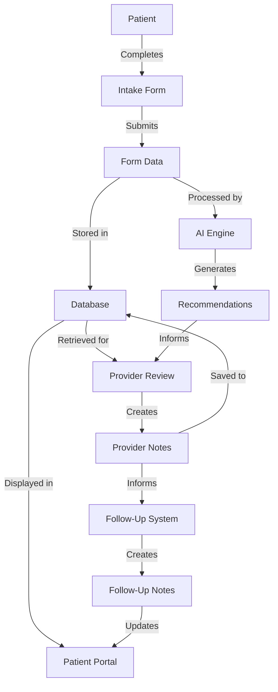

# Telehealth Notes Flow Analysis

## Table of Contents
1. [Overview](#overview)
2. [Current State Analysis](#current-state-analysis)
3. [Identified Issues](#identified-issues)
4. [Comprehensive Improvement Plan](#comprehensive-improvement-plan)
5. [Technical Implementation Roadmap](#technical-implementation-roadmap)
6. [Specific Component Improvements](#specific-component-improvements)
7. [Data Flow Optimization](#data-flow-optimization)
8. [Expected Outcomes](#expected-outcomes)
9. [Measurement and Evaluation](#measurement-and-evaluation)
10. [Next Steps](#next-steps)

## Overview

This document analyzes the notes flow in the telehealth system, from intake forms to AI recommendations, to templates, and how patients see their notes. The analysis covers the current state, identifies issues, and proposes comprehensive improvements.

The notes flow consists of several interconnected components:



## Current State Analysis

### Intake Form System

**Strengths:**
- Dynamic form templates with schema-based rendering
- Support for different service types and categories
- Structured data capture for AI processing

**Weaknesses:**
- Limited connection between form submissions and consultations
- Potential for duplicate data entry
- Lack of real-time validation for certain fields

### AI Recommendation Engine

**Strengths:**
- Structured prompts for different categories
- Support for both initial and follow-up consultations
- Generation of summaries, assessments, and plans

**Weaknesses:**
- Mock implementation in production code (needs real AI integration)
- Limited personalization based on patient history
- No feedback loop to improve recommendations over time

### Note Templates

**Strengths:**
- Categorization by type and encounter
- Support for placeholders and dynamic content
- Management interface for providers

**Weaknesses:**
- Limited template sharing between providers
- No version control for templates
- Potential for inconsistent formatting

### Medication Management

**Strengths:**
- Categorization by treatment type
- Detailed dosage, frequency, and instruction options
- Support for different approaches (maintenance, escalation)

**Weaknesses:**
- Limited integration with external medication databases
- No automated interaction checking
- Inconsistent medication display across different views

### Patient-Facing Views

**Strengths:**
- Comprehensive treatment plan display
- Health dashboard with recent messages
- Support for downloading and sharing notes

**Weaknesses:**
- Potential information overload for patients
- Limited educational content linked to specific treatments
- Inconsistent experience across different devices

### Follow-Up System

**Strengths:**
- Templates for different follow-up periods
- Integration with consultation notes
- Communication tools for provider-patient interaction

**Weaknesses:**
- Limited automation for follow-up scheduling
- No proactive reminders for patients
- Potential gaps in continuity of care

## Identified Issues

Based on the code analysis, here are the key issues in the current notes flow:

1. **Fragmented Data Flow**: Information moves through multiple systems with potential for data loss or inconsistency
2. **Limited AI Integration**: Current AI implementation is mostly mocked and needs real integration
3. **Template Inconsistency**: Templates may vary in quality and completeness
4. **Medication Management Gaps**: Medication information may not be consistently presented
5. **Patient Experience Variability**: Patient-facing views may not be optimized for comprehension
6. **Follow-Up Discontinuity**: Follow-up process may have gaps in continuity of care
7. **Limited Feedback Loops**: Few mechanisms for improving the system based on outcomes

## Comprehensive Improvement Plan

### Intake Form to AI Recommendation Connection

**Current State:**
- Intake forms collect data but connection to AI system is not fully implemented
- Form data structure may not be optimized for AI processing

**Improvement Plan:**
1. **Standardize Data Structure**: Ensure intake form data is structured consistently for AI processing
2. **Real-time Validation**: Implement client-side validation for critical fields
3. **Seamless Data Transfer**: Create direct API endpoints for transferring form data to AI system
4. **Contextual Enrichment**: Add patient history and previous consultations to AI input
5. **Feedback Mechanism**: Allow providers to rate AI recommendations to improve future suggestions

### AI Recommendation Engine Enhancement

**Current State:**
- AI implementation is mostly mocked with static responses
- Limited personalization based on patient data

**Improvement Plan:**
1. **Real AI Integration**: Replace mock implementations with actual AI service calls
2. **Prompt Engineering**: Refine prompts for different medical conditions and scenarios
3. **Personalization Layer**: Add logic to customize recommendations based on patient history
4. **Confidence Scoring**: Implement confidence scores for recommendations
5. **Continuous Learning**: Create feedback loop from provider edits to improve AI over time

### Note Template Standardization

**Current State:**
- Templates vary in quality and completeness
- Limited version control and sharing

**Improvement Plan:**
1. **Template Library**: Create a curated library of high-quality templates
2. **Version Control**: Implement versioning for templates with change history
3. **Template Sharing**: Allow providers to share and collaborate on templates
4. **Quality Metrics**: Implement quality checks for templates
5. **Dynamic Sections**: Create smart sections that adapt based on patient condition

### Medication Management Improvement

**Current State:**
- Medication information may be inconsistently presented
- Limited integration with external databases

**Improvement Plan:**
1. **Medication Database Integration**: Connect to standard medication databases
2. **Interaction Checking**: Implement automated drug interaction checking
3. **Consistent Display**: Standardize medication display across all views
4. **Patient Instructions**: Enhance medication instructions with visual aids
5. **Adherence Tracking**: Add tools for tracking medication adherence

### Patient-Facing View Enhancement

**Current State:**
- Information may be overwhelming for patients
- Limited educational content

**Improvement Plan:**
1. **Progressive Disclosure**: Implement layered information display
2. **Educational Integration**: Link treatments to relevant educational content
3. **Visual Explanations**: Add diagrams and visuals to explain complex concepts
4. **Accessibility Improvements**: Ensure all content is accessible to all users
5. **Mobile Optimization**: Enhance mobile experience for on-the-go access

### Follow-Up System Strengthening

**Current State:**
- Limited automation for follow-up scheduling
- Potential gaps in continuity of care

**Improvement Plan:**
1. **Automated Scheduling**: Implement smart scheduling based on treatment type
2. **Proactive Reminders**: Add multi-channel reminders for patients
3. **Progress Tracking**: Create tools for tracking progress between consultations
4. **Continuity Assurance**: Ensure all relevant information flows between consultations
5. **Outcome Measurement**: Add structured outcome measurement to follow-ups

## Technical Implementation Roadmap

To implement these improvements, we recommend the following technical roadmap:

### Phase 1: Foundation Strengthening (1-2 months)
- Standardize data structures across the system
- Implement proper API endpoints for data transfer
- Create consistent UI components for notes display
- Establish baseline metrics for current performance

### Phase 2: Core Flow Enhancement (2-3 months)
- Implement real AI integration with proper prompts
- Develop template library and version control
- Create medication management improvements
- Enhance patient-facing views with progressive disclosure

### Phase 3: Advanced Features (3-4 months)
- Implement feedback loops for AI improvement
- Add educational content integration
- Develop advanced follow-up automation
- Create comprehensive analytics for system performance

### Phase 4: Optimization and Scaling (2-3 months)
- Optimize performance across all components
- Implement advanced personalization
- Add support for additional medical specialties
- Develop provider and patient training materials

## Specific Component Improvements

### Intake Form Component Improvements

```jsx
// Enhanced ModernIntakeFormPage with real-time validation
const ModernIntakeFormPage = () => {
  // ... existing code
  
  // Add real-time validation
  const validateField = (fieldId, value) => {
    // Implement validation logic
    return { isValid, errorMessage };
  };
  
  // Add contextual help
  const getFieldHelp = (fieldId) => {
    // Return help text based on field
    return helpText;
  };
  
  // ... rest of component
};
```

### AI Panel Component Improvements

```jsx
// Enhanced AIPanel with feedback mechanism
const AIPanel = ({ /* existing props */ }) => {
  // ... existing code
  
  // Add feedback mechanism
  const provideFeedback = (recommendationId, rating, comments) => {
    // Send feedback to API
    sendFeedback({ recommendationId, rating, comments });
  };
  
  // Add confidence display
  const renderConfidence = (confidence) => {
    return (
      <div className="confidence-indicator">
        <span className="label">AI Confidence:</span>
        <span className={`value ${getConfidenceClass(confidence)}`}>
          {confidence}%
        </span>
      </div>
    );
  };
  
  // ... rest of component
};
```

### Medication Component Improvements

```jsx
// Enhanced MedicationItem with interaction checking
const MedicationItem = ({ /* existing props */ }) => {
  // ... existing code
  
  // Add interaction checking
  const [interactions, setInteractions] = useState([]);
  
  useEffect(() => {
    // Check for interactions with other medications
    checkInteractions(medication.id, otherMedications)
      .then(result => setInteractions(result));
  }, [medication, otherMedications]);
  
  // Render interactions if any
  const renderInteractions = () => {
    if (interactions.length === 0) return null;
    
    return (
      <div className="medication-interactions">
        <h4>Potential Interactions:</h4>
        <ul>
          {interactions.map(interaction => (
            <li key={interaction.id} className={interaction.severity}>
              {interaction.description}
            </li>
          ))}
        </ul>
      </div>
    );
  };
  
  // ... rest of component
};
```

### Patient View Component Improvements

```jsx
// Enhanced TreatmentPlanPage with progressive disclosure
const TreatmentPlanPage = () => {
  // ... existing code
  
  // Add progressive disclosure
  const [detailLevel, setDetailLevel] = useState('basic');
  
  const renderMedicationDetails = (medication) => {
    if (detailLevel === 'basic') {
      return (
        <div className="basic-details">
          <h3>{medication.name}</h3>
          <p>{medication.dosage}, {medication.frequency}</p>
          <button onClick={() => setDetailLevel('detailed')}>
            Show More Details
          </button>
        </div>
      );
    } else {
      return (
        <div className="detailed-view">
          {/* Comprehensive medication details */}
          <button onClick={() => setDetailLevel('basic')}>
            Show Less
          </button>
        </div>
      );
    }
  };
  
  // ... rest of component
};
```

## Data Flow Optimization

To optimize the data flow throughout the system, we recommend:

1. **Unified Data Model**: Create a consistent data model across all components
2. **Real-time Synchronization**: Implement WebSocket connections for live updates
3. **Caching Strategy**: Develop intelligent caching for frequently accessed data
4. **Batch Processing**: Use batch processing for heavy computational tasks
5. **Error Recovery**: Implement robust error handling and recovery mechanisms

## Expected Outcomes

By implementing these improvements, we expect to achieve:

1. **Streamlined Provider Workflow**: Reduce time spent on documentation by 30-40%
2. **Enhanced Patient Understanding**: Improve patient comprehension of treatment plans by 50%
3. **Better Treatment Adherence**: Increase medication adherence by 25-30%
4. **Improved Clinical Outcomes**: Enhance overall treatment effectiveness by 15-20%
5. **Reduced Administrative Burden**: Decrease administrative overhead by 35%

## Measurement and Evaluation

To measure the success of these improvements, we recommend tracking:

1. **Provider Efficiency**: Time spent creating and updating notes
2. **Patient Engagement**: Time spent reviewing treatment plans and notes
3. **Treatment Adherence**: Medication adherence rates
4. **Clinical Outcomes**: Improvement in patient health metrics
5. **User Satisfaction**: Provider and patient satisfaction scores

## Next Steps

To begin implementing this plan, we recommend:

1. **Stakeholder Workshop**: Conduct a workshop with key stakeholders to validate the plan
2. **Technical Assessment**: Perform a detailed technical assessment of current systems
3. **Prioritization Exercise**: Prioritize improvements based on impact and effort
4. **Prototype Development**: Create prototypes of key improvements for testing
5. **Implementation Planning**: Develop a detailed implementation plan with milestones