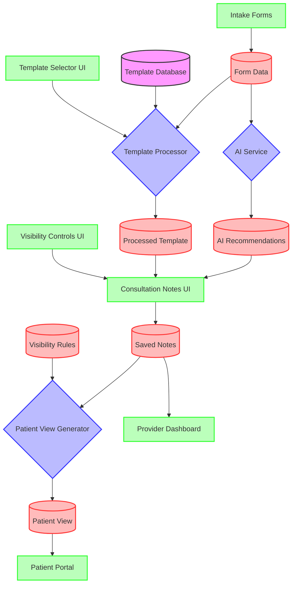
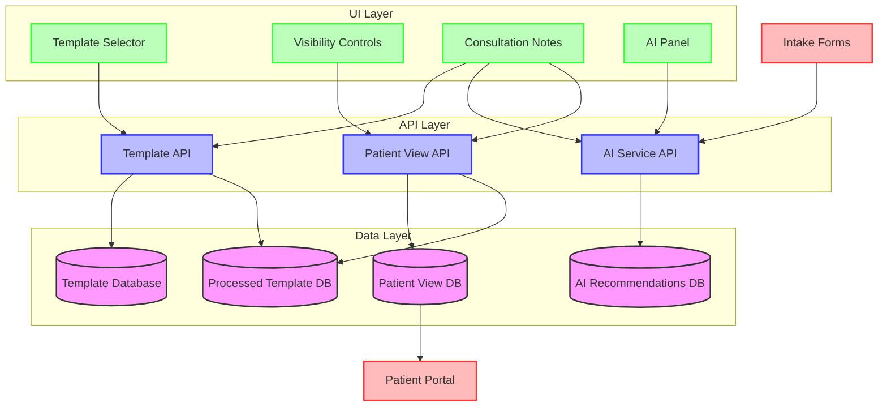
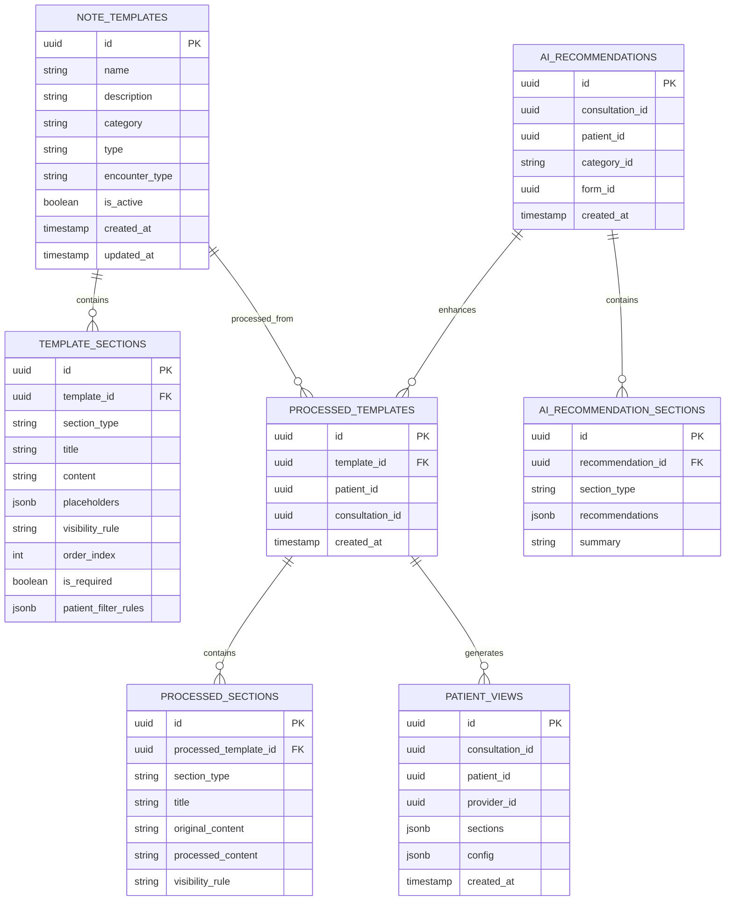
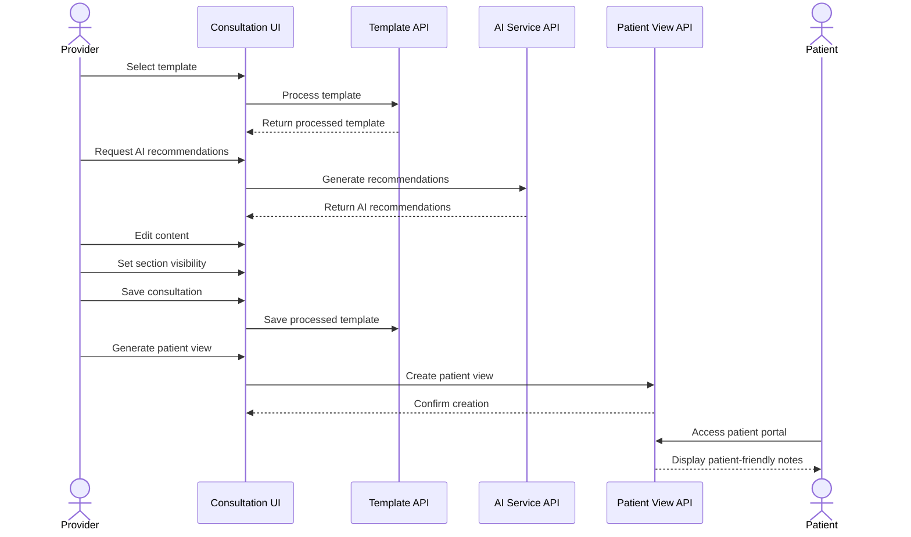

# Notes Flow System: Architecture Diagram

This document provides visual diagrams of the Notes Flow System architecture, showing the data flow between components and the overall system structure.

## Data Flow Diagram

## Component Architecture

## Data Model Relationships

## User Flow Diagram

These diagrams provide a comprehensive view of the Notes Flow System architecture, showing:

1. **Data Flow Diagram**: How data moves between different components of the system
2. **Component Architecture**: The layered structure of the system and component relationships
3. **Data Model Relationships**: The database schema and relationships between entities
4. **User Flow Diagram**: The sequence of interactions between users and system components

The architecture follows a modular design with clear separation of concerns:
- UI components for user interaction
- API layer for business logic
- Data layer for persistence
- Clear integration points with existing systems

This design ensures flexibility, maintainability, and scalability as the system evolves.