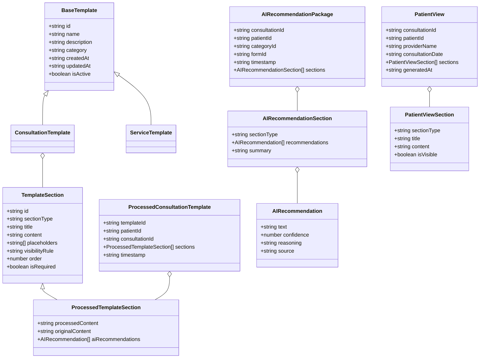
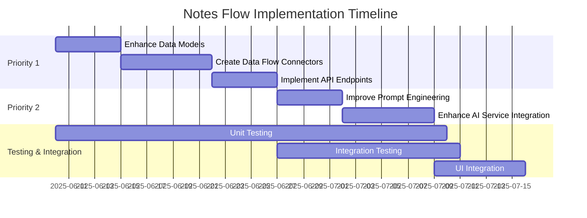

# Notes Flow Implementation Plan

Based on our analysis of the current codebase and the implementation roadmap, this document outlines a detailed plan to complete the remaining priorities for the notes flow system.

## Current Status

We've successfully completed Priority 3 (Note Templates Standardization):
- Created TypeScript interfaces in `src/types/notesFlow.ts`
- Implemented API functions in `src/apis/noteTemplates/api.js`
- Created React hooks in `src/apis/noteTemplates/hooks.js`
- Added validation functions for templates

## Priority 1: Data Structure and Flow Standardization

### 1.1 Enhance Data Models (Week 1)



#### Tasks:
1. **Create Data Flow Interfaces** - Define interfaces for data flow between components
   ```typescript
   // src/types/notesFlow.ts
   
   export interface DataFlowEvent {
     type: 'template_processed' | 'ai_recommendation_generated' | 'patient_view_generated';
     timestamp: string;
     payload: any;
     metadata: {
       userId: string;
       sessionId: string;
       source: string;
     };
   }
   
   export interface DataConnector<T, U> {
     transform(input: T): U;
     validate(input: T): boolean;
     process(input: T): Promise<U>;
   }
   ```

2. **Implement Validation Functions** - Create comprehensive validation for all data models
   ```typescript
   // Add to src/types/notesFlow.ts
   
   export function validateAIRecommendation(recommendation: any): boolean {
     if (!recommendation.text || typeof recommendation.confidence !== 'number') {
       throw new Error('Invalid AI recommendation format');
     }
     return true;
   }
   
   export function validatePatientView(view: any): boolean {
     if (!view.consultationId || !view.patientId || !view.sections) {
       throw new Error('Invalid patient view format');
     }
     return true;
   }
   ```

### 1.2 Create Data Flow Connectors (Week 1-2)

#### Tasks:
1. **Create Template Processor Connector** - Transform templates into processed templates
   ```typescript
   // src/connectors/templateProcessor.ts
   
   import { ConsultationTemplate, ProcessedConsultationTemplate } from '../types/notesFlow';
   
   export class TemplateProcessorConnector {
     async process(
       template: ConsultationTemplate, 
       patientId: string, 
       consultationId: string
     ): Promise<ProcessedConsultationTemplate> {
       // Implementation
     }
     
     replacePlaceholders(content: string, data: Record<string, any>): string {
       // Implementation
     }
   }
   ```

2. **Create AI Recommendation Connector** - Connect intake forms to AI recommendations
   ```typescript
   // src/connectors/aiRecommendationConnector.ts
   
   import { AIRecommendationPackage } from '../types/notesFlow';
   
   export class AIRecommendationConnector {
     async process(
       formData: any, 
       patientId: string, 
       consultationId: string
     ): Promise<AIRecommendationPackage> {
       // Implementation
     }
   }
   ```

3. **Create Patient View Connector** - Transform processed templates into patient views
   ```typescript
   // src/connectors/patientViewConnector.ts
   
   import { ProcessedConsultationTemplate, PatientView, PatientViewConfig } from '../types/notesFlow';
   
   export class PatientViewConnector {
     async process(
       processedTemplate: ProcessedConsultationTemplate,
       viewConfig: PatientViewConfig
     ): Promise<PatientView> {
       // Implementation
     }
     
     simplifyLanguage(text: string): string {
       // Implementation
     }
   }
   ```

### 1.3 Implement API Endpoints (Week 2)

#### Tasks:
1. **Create Standardized API Module** - Implement consistent API patterns
   ```typescript
   // src/apis/notesFlow/api.ts
   
   import { supabase } from '../../lib/supabase';
   import { 
     ConsultationTemplate, 
     ProcessedConsultationTemplate,
     AIRecommendationPackage,
     PatientView
   } from '../../types/notesFlow';
   
   // Template APIs
   export const getTemplates = async (filters = {}): Promise<ConsultationTemplate[]> => {
     // Implementation
   };
   
   // Processed Template APIs
   export const getProcessedTemplates = async (consultationId: string): Promise<ProcessedConsultationTemplate[]> => {
     // Implementation
   };
   
   // AI Recommendation APIs
   export const getAIRecommendations = async (consultationId: string): Promise<AIRecommendationPackage> => {
     // Implementation
   };
   
   // Patient View APIs
   export const getPatientViews = async (consultationId: string): Promise<PatientView[]> => {
     // Implementation
   };
   ```

2. **Create React Query Hooks** - Implement hooks for data fetching
   ```typescript
   // src/apis/notesFlow/hooks.ts
   
   import { useQuery, useMutation } from 'react-query';
   import { 
     getTemplates, 
     getProcessedTemplates,
     getAIRecommendations,
     getPatientViews
   } from './api';
   
   export const useTemplates = (filters = {}) => {
     return useQuery(['templates', filters], () => getTemplates(filters));
   };
   
   export const useProcessedTemplates = (consultationId: string) => {
     return useQuery(
       ['processedTemplates', consultationId], 
       () => getProcessedTemplates(consultationId)
     );
   };
   
   // Additional hooks...
   ```

## Priority 2: AI Recommendation Engine Enhancement

### 2.1 Improve Prompt Engineering (Week 3)

#### Tasks:
1. **Create Specialized Prompts** - Develop category-specific prompts
   ```typescript
   // src/apis/ai/prompts.ts
   
   export const ASSESSMENT_PROMPTS = {
     weight_management: `
       Based on the patient's intake form for weight management:
       1. Summarize key health metrics (BMI, weight history)
       2. Identify potential contraindications for GLP-1 medications
       3. Suggest appropriate medication options with dosing
       4. Recommend lifestyle modifications
     `,
     ed: `
       Based on the patient's intake form for ED treatment:
       1. Summarize cardiovascular risk factors
       2. Identify potential contraindications for PDE5 inhibitors
       3. Suggest appropriate medication options with dosing
       4. Recommend lifestyle modifications
     `,
     // Additional categories...
   };
   ```

2. **Implement Context-Aware Prompt Selection** - Choose prompts based on patient data
   ```typescript
   // src/apis/ai/promptSelector.ts
   
   import { ASSESSMENT_PROMPTS } from './prompts';
   
   export const selectPrompt = (
     category: string, 
     patientData: any, 
     promptType: 'assessment' | 'plan' | 'summary'
   ): string => {
     // Select base prompt
     const basePrompt = ASSESSMENT_PROMPTS[category] || ASSESSMENT_PROMPTS.general;
     
     // Enhance with patient-specific context
     const enhancedPrompt = addPatientContext(basePrompt, patientData);
     
     return enhancedPrompt;
   };
   ```

### 2.2 Enhance AI Service Integration (Week 3-4)

#### Tasks:
1. **Implement Enhanced AI Service** - Improve AI recommendation generation
   ```typescript
   // src/apis/ai/enhancedSummaryService.ts
   
   import { AIRecommendationPackage } from '../../types/notesFlow';
   import { selectPrompt } from './promptSelector';
   
   export const generateEnhancedAIRecommendations = async (
     formData: any,
     patientId: string,
     consultationId: string,
     categoryId: string
   ): Promise<AIRecommendationPackage> => {
     // Select appropriate prompts
     const assessmentPrompt = selectPrompt(categoryId, formData, 'assessment');
     const planPrompt = selectPrompt(categoryId, formData, 'plan');
     
     // Generate recommendations with enhanced prompts
     const assessmentResult = await generateWithAI(assessmentPrompt, formData);
     const planResult = await generateWithAI(planPrompt, formData);
     
     // Format as AIRecommendationPackage
     return {
       consultationId,
       patientId,
       categoryId,
       formId: formData.id,
       timestamp: new Date().toISOString(),
       sections: [
         {
           sectionType: 'assessment',
           recommendations: parseRecommendations(assessmentResult),
           summary: assessmentResult.summary
         },
         {
           sectionType: 'plan',
           recommendations: parseRecommendations(planResult),
           summary: planResult.summary
         }
       ]
     };
   };
   ```

2. **Create Confidence Scoring** - Add confidence metrics to recommendations
   ```typescript
   // src/apis/ai/confidenceScoring.ts
   
   export const scoreConfidence = (
     recommendation: string, 
     patientData: any
   ): number => {
     // Implementation of confidence scoring algorithm
     // Based on:
     // 1. Presence of contraindications
     // 2. Alignment with guidelines
     // 3. Consistency with patient history
     
     let score = 0.8; // Base confidence
     
     // Adjust based on various factors
     
     return Math.min(Math.max(score, 0), 1); // Ensure between 0-1
   };
   ```

## Implementation Timeline



## Next Steps

1. **Begin with Priority 1.1**: Enhance the data models by adding the missing interfaces and validation functions to `src/types/notesFlow.ts`
2. **Create the data flow connectors**: Implement the connector classes to transform data between different parts of the system
3. **Standardize the API endpoints**: Create consistent API functions and React Query hooks
4. **Move to Priority 2**: Once the data structure is standardized, enhance the AI recommendation engine

## Dependencies and Requirements

- TypeScript knowledge for interface definitions
- React Query for data fetching
- Supabase for database operations
- Understanding of AI prompt engineering
- Testing framework for validation

## Risks and Mitigations

| Risk | Impact | Mitigation |
|------|--------|------------|
| Database schema changes | High | Use migration scripts with fallbacks |
| AI service reliability | Medium | Implement caching and fallback content |
| Performance issues with complex templates | Medium | Implement pagination and lazy loading |
| Backward compatibility | High | Create adapters for legacy data formats |

## Success Criteria

- All data models have comprehensive validation
- Data flows seamlessly between components
- AI recommendations are more accurate and relevant
- Patient views are properly formatted and accessible
- System gracefully handles errors and edge cases