# Comprehensive Routing Architecture Flowchart

This Mermaid flowchart synthesizes the complete routing architecture analysis, providing a definitive visualization of the entire request lifecycle from initial routing to final response generation.

```mermaid
flowchart TB
    %% Entry Point Layer
    subgraph ENTRY["🌐 Entry Point Layer"]
        START([Client Request]) --> ROUTE_MATCHER{Route Matcher<br/>React Router}
        ROUTE_MATCHER --> PUBLIC_ROUTES{Public Route?}
        ROUTE_MATCHER --> PROTECTED_ROUTES{Protected Route?}
        ROUTE_MATCHER --> REDIRECT_ROUTES{Redirect Route?}
    end

    %% Public Routes (No Auth Required)
    subgraph PUBLIC["🔓 Public Routes"]
        PUBLIC_ROUTES -->|/login| LOGIN[Login Page]
        PUBLIC_ROUTES -->|/signup| SIGNUP[Signup Page]
        PUBLIC_ROUTES -->|/forms/:formId| FORM_VIEWER[Form Viewer]
        LOGIN --> AUTH_SERVICE[Authentication Service]
        SIGNUP --> AUTH_SERVICE
    end

    %% Route Resolution Layer
    subgraph RESOLUTION["🔍 Route Resolution Layer"]
        PROTECTED_ROUTES --> MAIN_LAYOUT[Main Layout Component]
        MAIN_LAYOUT --> ROUTE_GUARD{Protected Route Guard}
        ROUTE_GUARD --> VIEW_MODE_CHECK{View Mode Check<br/>Admin vs Patient}
        VIEW_MODE_CHECK --> LAZY_LOAD[Lazy Load Component]
    end

    %% Authentication Layer
    subgraph AUTH["🔐 Authentication Layer"]
        ROUTE_GUARD -->|Not Authenticated| AUTH_CHECK[Authentication Check]
        AUTH_CHECK --> SESSION_VALID{Session Valid?}
        SESSION_VALID -->|No| LOGIN_REDIRECT[Redirect to Login]
        SESSION_VALID -->|Yes| USER_ROLE[Get User Role]
        USER_ROLE --> ROLE_CHECK{Role Check}
        ROLE_CHECK -->|Admin| ADMIN_CONTEXT[Admin Context]
        ROLE_CHECK -->|Patient| PATIENT_CONTEXT[Patient Context]
        
        %% Session Management
        AUTH_CHECK --> SUPABASE_AUTH[Supabase Auth]
        SUPABASE_AUTH --> PROFILE_FETCH[Fetch User Profile]
        PROFILE_FETCH --> ROLE_ASSIGNMENT[Role Assignment]
    end

    %% Route Categories
    subgraph ROUTES["🗺️ Route Categories (60+ Routes)"]
        LAZY_LOAD --> ADMIN_ROUTES{Admin Routes}
        LAZY_LOAD --> PATIENT_ROUTES{Patient Routes}
        LAZY_LOAD --> MANAGEMENT_ROUTES{Management Routes}
        LAZY_LOAD --> SYSTEM_ROUTES{System Routes}
        
        %% Admin Routes
        ADMIN_ROUTES -->|/dashboard| DASHBOARD[Dashboard]
        ADMIN_ROUTES -->|/patients/:id| PATIENT_DETAIL[Patient Detail]
        ADMIN_ROUTES -->|/sessions| SESSIONS[Sessions/Consultations]
        ADMIN_ROUTES -->|/orders| ORDERS[Order Management]
        ADMIN_ROUTES -->|/invoices| INVOICES[Invoice Management]
        ADMIN_ROUTES -->|/admin/*| ADMIN_PAGES[Admin Management]
        
        %% Patient Routes
        PATIENT_ROUTES -->|/patient-home| PATIENT_HOME[Patient Home]
        PATIENT_ROUTES -->|/my-services| PATIENT_SERVICES[Patient Services]
        PATIENT_ROUTES -->|/shop| SHOP[Shop Page]
        PATIENT_ROUTES -->|/programs| PROGRAMS[Programs]
        PATIENT_ROUTES -->|/health| HEALTH[Health Dashboard]
        
        %% Management Routes
        MANAGEMENT_ROUTES -->|/providers| PROVIDERS[Provider Management]
        MANAGEMENT_ROUTES -->|/pharmacies| PHARMACIES[Pharmacy Management]
        MANAGEMENT_ROUTES -->|/tasks| TASKS[Task Management]
        MANAGEMENT_ROUTES -->|/insurance| INSURANCE[Insurance Documentation]
        
        %% System Routes
        SYSTEM_ROUTES -->|/settings/*| SETTINGS[Settings Pages]
        SYSTEM_ROUTES -->|/messages| MESSAGING[Messaging System]
        SYSTEM_ROUTES -->|/notifications| NOTIFICATIONS[Notifications]
        SYSTEM_ROUTES -->|/audit-log| AUDIT_LOG[Audit Log]
    end

    %% Service Layer
    subgraph SERVICES["⚙️ Service Layer"]
        DASHBOARD --> PATIENT_SERVICE[Patient Service]
        PATIENT_DETAIL --> CONSULTATION_SERVICE[Consultation Service]
        SESSIONS --> CONSULTATION_SERVICE
        ORDERS --> ORDER_SERVICE[Order Service]
        INVOICES --> INVOICE_SERVICE[Invoice Service]
        PATIENT_SERVICES --> SUBSCRIPTION_SERVICE[Subscription Service]
        SHOP --> PRODUCT_SERVICE[Product Service]
        PROGRAMS --> PROGRAM_SERVICE[Program Service]
        HEALTH --> MEASUREMENT_SERVICE[Measurement Service]
        PROVIDERS --> PROVIDER_SERVICE[Provider Service]
        PHARMACIES --> PHARMACY_SERVICE[Pharmacy Service]
        TASKS --> TASK_SERVICE[Task Service]
        MESSAGING --> NOTIFICATION_SERVICE[Notification Service]
        
        %% Service Dependencies
        CONSULTATION_SERVICE --> AI_SERVICE[AI Summary Service]
        ORDER_SERVICE --> PAYMENT_SERVICE[Payment Service]
        INVOICE_SERVICE --> BILLING_SERVICE[Billing Service]
        SUBSCRIPTION_SERVICE --> RECOMMENDATION_SERVICE[Recommendation Service]
    end

    %% Database Layer
    subgraph DATABASE["🗄️ Database Layer (Supabase)"]
        PATIENT_SERVICE --> PATIENTS_TABLE[(patients)]
        CONSULTATION_SERVICE --> CONSULTATIONS_TABLE[(consultations)]
        CONSULTATION_SERVICE --> AI_SUMMARIES_TABLE[(ai_summaries)]
        ORDER_SERVICE --> ORDERS_TABLE[(orders)]
        INVOICE_SERVICE --> INVOICES_TABLE[(invoices)]
        SUBSCRIPTION_SERVICE --> SUBSCRIPTIONS_TABLE[(subscriptions)]
        PRODUCT_SERVICE --> PRODUCTS_TABLE[(products)]
        PROGRAM_SERVICE --> PROGRAM_CONTENT_TABLE[(program_content)]
        MEASUREMENT_SERVICE --> MEASUREMENTS_TABLE[(measurements)]
        PROVIDER_SERVICE --> PROVIDERS_TABLE[(providers)]
        PHARMACY_SERVICE --> PHARMACIES_TABLE[(pharmacies)]
        TASK_SERVICE --> TASKS_TABLE[(pb_tasks)]
        NOTIFICATION_SERVICE --> NOTIFICATIONS_TABLE[(notifications)]
        
        %% RPC Functions
        PATIENTS_TABLE --> RPC_FUNCTIONS[RPC Functions]
        CONSULTATIONS_TABLE --> RPC_FUNCTIONS
        ORDERS_TABLE --> RPC_FUNCTIONS
        RPC_FUNCTIONS --> BUSINESS_LOGIC[Business Logic Operations]
    end

    %% Data Flow and Response Layer
    subgraph RESPONSE["📤 Response Layer"]
        PATIENTS_TABLE --> DATA_TRANSFORM[Data Transformation]
        CONSULTATIONS_TABLE --> DATA_TRANSFORM
        ORDERS_TABLE --> DATA_TRANSFORM
        INVOICES_TABLE --> DATA_TRANSFORM
        SUBSCRIPTIONS_TABLE --> DATA_TRANSFORM
        PRODUCTS_TABLE --> DATA_TRANSFORM
        
        DATA_TRANSFORM --> RESPONSE_FORMAT[Response Formatting]
        RESPONSE_FORMAT --> UI_RENDER[UI Component Rendering]
        UI_RENDER --> CLIENT_RESPONSE[Client Response]
    end

    %% Error Handling
    subgraph ERROR_HANDLING["⚠️ Error Handling"]
        AUTH_CHECK -->|Auth Error| AUTH_ERROR[Authentication Error]
        SUPABASE_AUTH -->|Connection Error| DB_ERROR[Database Error]
        LAZY_LOAD -->|Load Error| COMPONENT_ERROR[Component Load Error]
        DATA_TRANSFORM -->|Transform Error| DATA_ERROR[Data Error]
        
        AUTH_ERROR --> ERROR_BOUNDARY[Error Boundary]
        DB_ERROR --> ERROR_BOUNDARY
        COMPONENT_ERROR --> ERROR_BOUNDARY
        DATA_ERROR --> ERROR_BOUNDARY
        
        ERROR_BOUNDARY --> ERROR_LOGGING[Error Logging Service]
        ERROR_BOUNDARY --> FALLBACK_UI[Fallback UI]
        ERROR_BOUNDARY --> ERROR_RECOVERY[Error Recovery]
    end

    %% Middleware and Interceptors
    subgraph MIDDLEWARE["🛡️ Middleware Layer"]
        ROUTE_GUARD --> SESSION_MIDDLEWARE[Session Middleware]
        SESSION_MIDDLEWARE --> ROLE_MIDDLEWARE[Role-Based Access Control]
        ROLE_MIDDLEWARE --> API_MIDDLEWARE[API Request Middleware]
        API_MIDDLEWARE --> LOGGING_MIDDLEWARE[Logging Middleware]
        
        %% Custom Hooks Integration
        API_MIDDLEWARE --> USE_API_HOOK[useApi Hook]
        USE_API_HOOK --> ERROR_HANDLER[Error Handler]
        USE_API_HOOK --> LOADING_STATE[Loading State Management]
    end

    %% Real-time Features
    subgraph REALTIME["🔄 Real-time Features"]
        SUPABASE_AUTH --> REALTIME_SUBSCRIPTION[Realtime Subscriptions]
        REALTIME_SUBSCRIPTION --> NOTIFICATION_UPDATES[Notification Updates]
        REALTIME_SUBSCRIPTION --> DATA_SYNC[Data Synchronization]
        DATA_SYNC --> UI_UPDATE[Live UI Updates]
    end

    %% Mobile/Desktop Layout
    subgraph LAYOUT["📱 Layout Management"]
        MAIN_LAYOUT --> DEVICE_DETECTION[Device Detection]
        DEVICE_DETECTION --> MOBILE_LAYOUT{Mobile Layout?}
        DEVICE_DETECTION --> DESKTOP_LAYOUT{Desktop Layout?}
        
        MOBILE_LAYOUT -->|Yes| BOTTOM_NAV[Bottom Navigation]
        MOBILE_LAYOUT -->|Yes| TOP_NAV[Top Navigation]
        DESKTOP_LAYOUT -->|Yes| SIDEBAR[Sidebar Navigation]
        DESKTOP_LAYOUT -->|Yes| HEADER[Header Navigation]
        
        BOTTOM_NAV --> MOBILE_UI[Mobile UI Components]
        SIDEBAR --> DESKTOP_UI[Desktop UI Components]
    end

    %% Redirects and Route Guards
    REDIRECT_ROUTES -->|/ → /dashboard| DASHBOARD
    REDIRECT_ROUTES -->|/marketplace → /shop| SHOP
    REDIRECT_ROUTES -->|/patient-home → /patient-home| PATIENT_HOME
    REDIRECT_ROUTES -->|/products → /admin/product-subscription| ADMIN_PAGES
    REDIRECT_ROUTES -->|/* → /| DASHBOARD

    %% Styling and performance
    CLIENT_RESPONSE --> PERFORMANCE_MONITOR[Performance Monitoring]
    UI_RENDER --> LAZY_LOADING[Component Lazy Loading]
    UI_RENDER --> SUSPENSE_FALLBACK[Suspense Fallback]

    %% Connect flows
    AUTH_SERVICE --> SESSION_VALID
    LOGIN_REDIRECT --> LOGIN
    ADMIN_CONTEXT --> ADMIN_ROUTES
    PATIENT_CONTEXT --> PATIENT_ROUTES
    
    classDef entryPoint fill:#e1f5fe
    classDef auth fill:#fff3e0
    classDef services fill:#e8f5e8
    classDef database fill:#fce4ec
    classDef error fill:#ffebee
    classDef middleware fill:#f3e5f5
    classDef layout fill:#e0f2f1
    
    class START,ROUTE_MATCHER entryPoint
    class AUTH_CHECK,SESSION_VALID,USER_ROLE,SUPABASE_AUTH auth
    class PATIENT_SERVICE,CONSULTATION_SERVICE,ORDER_SERVICE,INVOICE_SERVICE services
    class PATIENTS_TABLE,CONSULTATIONS_TABLE,ORDERS_TABLE,INVOICES_TABLE database
    class AUTH_ERROR,DB_ERROR,COMPONENT_ERROR,ERROR_BOUNDARY error
    class SESSION_MIDDLEWARE,ROLE_MIDDLEWARE,API_MIDDLEWARE middleware
    class MOBILE_LAYOUT,DESKTOP_LAYOUT,BOTTOM_NAV,SIDEBAR layout
```

## Key Architecture Features

### 1. **Route Categories (60+ Routes)**
- **Admin Routes**: `/dashboard`, `/patients/:id`, `/sessions`, `/orders`, `/invoices`, `/admin/*`
- **Patient Routes**: `/patient-home`, `/my-services`, `/shop`, `/programs`, `/health`
- **Management Routes**: `/providers`, `/pharmacies`, `/tasks`, `/insurance`
- **System Routes**: `/settings/*`, `/messages`, `/notifications`, `/audit-log`

### 2. **Authentication & Authorization**
- **Supabase Authentication**: Session management with automatic token refresh
- **Role-Based Access Control**: Admin vs Patient role determination
- **Protected Route Guards**: Session validation and redirect handling
- **Profile Integration**: User role fetching from database profiles table

### 3. **Service Layer Architecture**
- **Dedicated Services**: Consultation, Order, Invoice, Subscription, etc.
- **AI Integration**: AI summary service for consultation processing
- **Payment Processing**: Integrated payment and billing services
- **Recommendation Engine**: Product and content recommendation system

### 4. **Database Operations (Supabase)**
- **Core Tables**: patients, consultations, orders, invoices, subscriptions, etc.
- **RPC Functions**: Server-side business logic operations
- **Real-time Subscriptions**: Live data updates and notifications
- **Storage Integration**: File upload and document management

### 5. **Error Handling & Recovery**
- **Error Boundaries**: Component-level error catching
- **Service Error Handling**: API error interception and logging
- **Fallback Mechanisms**: Graceful degradation and recovery
- **User-Friendly Error Messages**: Context-aware error presentation

### 6. **Middleware & Interceptors**
- **Session Middleware**: Authentication state management
- **API Middleware**: Request/response interception
- **Logging Middleware**: Comprehensive request/error logging
- **Custom Hooks**: useApi for standardized API interactions

### 7. **Layout & Navigation**
- **Responsive Design**: Mobile-first with desktop adaptations
- **Conditional Navigation**: Bottom nav (mobile) vs Sidebar (desktop)
- **View Mode Switching**: Admin vs Patient interface toggling
- **Lazy Loading**: Performance-optimized component loading

This flowchart serves as the definitive reference for understanding the complete request lifecycle, from initial routing through authentication, service processing, database operations, and final UI rendering, including all security gates, error handling, and real-time features.