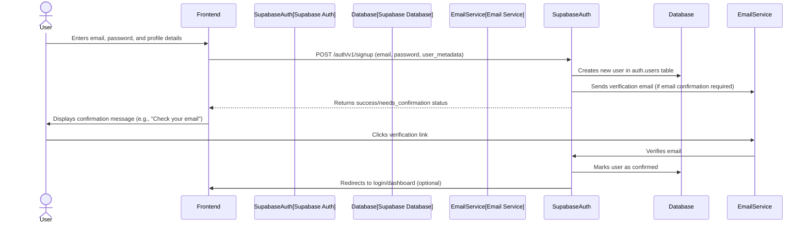
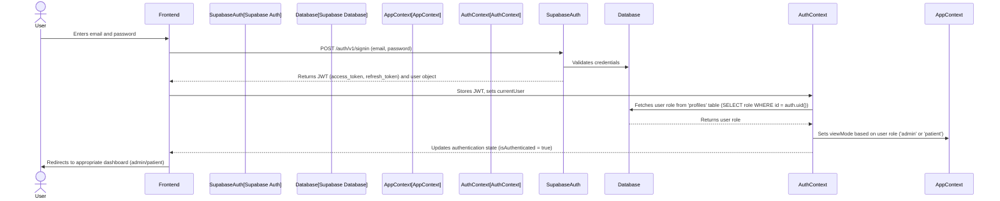
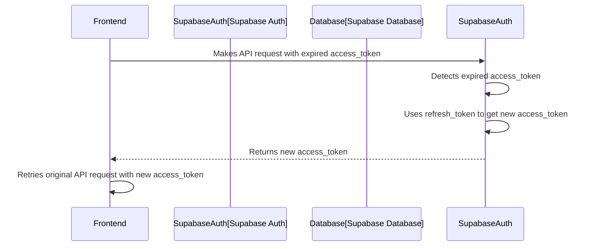
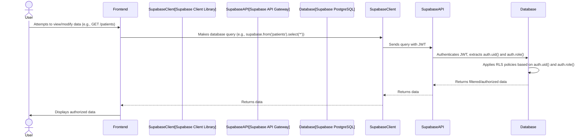
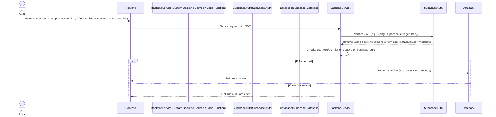
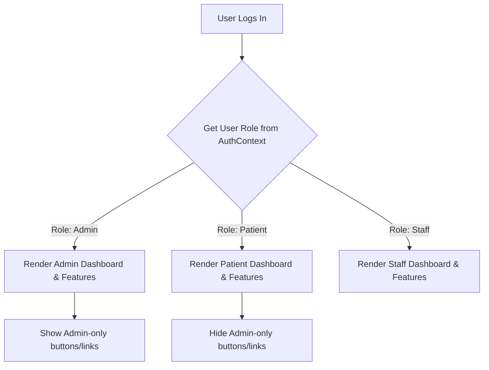

# Telehealth Application Authentication and Authorization Flows

This document details the authentication and authorization mechanisms for the rewritten telehealth application, emphasizing security, HIPAA compliance, and a seamless user experience.

## 1. Core Principles

*   **Strong Authentication**: Secure user identity verification.
*   **Role-Based Access Control (RBAC)**: Granular control over resource access based on user roles.
*   **Least Privilege**: Users and services are granted only the minimum necessary permissions.
*   **Data Confidentiality**: Protect sensitive patient health information (PHI).
*   **Auditability**: Log all security-relevant events.
*   **Scalability**: Mechanisms should scale with user growth.

## 2. Authentication Flow

The application leverages **Supabase Auth** as its primary authentication provider, supporting email/password and potentially OAuth (e.g., Google) in the future.

### 2.1. User Signup (Registration)

### 2.2. User Login (Email/Password)

### 2.3. Session Management & Refresh

Supabase Auth automatically handles JWT refresh using refresh tokens.

Additionally, `AuthContext` includes periodic session validation and re-validation on tab visibility change to ensure session freshness and handle potential expiry while the user is away.

## 3. Authorization Flow (Role-Based Access Control - RBAC)

Authorization is enforced at multiple layers:

1.  **Supabase Row Level Security (RLS)**: Primary and most secure layer.
2.  **Backend API/Edge Function Logic**: For complex business rules beyond RLS.
3.  **Frontend UI Logic**: For conditionally rendering UI elements (least secure, easily bypassed).

### 3.1. Supabase Row Level Security (RLS)

RLS policies are defined directly on database tables to restrict which rows a user can access or modify based on their `auth.uid()` and `auth.role()`.

**Examples of RLS Policies:**

*   **Patients Table**:
    *   `FOR SELECT USING (auth.uid() = id)`: A patient can only view their own record.
    *   `FOR SELECT USING (auth.role() = 'admin' OR auth.role() = 'staff')`: Admins and staff can view all patient records.
    *   `FOR INSERT WITH CHECK (auth.role() = 'admin' OR auth.role() = 'staff')`: Only admins/staff can create new patients.
*   **Invoices Table**:
    *   `FOR SELECT USING (EXISTS (SELECT 1 FROM patients WHERE patients.id = invoices.patients_id AND patients.id = auth.uid()))`: Patients can view their own invoices.
    *   `FOR ALL USING (auth.role() = 'admin')`: Admins have full access.
*   **Messages Table**:
    *   `FOR SELECT USING (conversation_id IN (SELECT conversation_id FROM conversation_participants WHERE user_id = auth.uid()))`: Users can only view messages in conversations they are part of.

### 3.2. Backend API / Edge Function Authorization

For custom API endpoints (e.g., complex integrations, AI processing), additional authorization logic is implemented in the backend.

### 3.3. Frontend UI Authorization (Conditional Rendering)

This layer is for user experience only and should *never* be relied upon for security. It prevents unauthorized users from even seeing options they cannot access.

## 4. Security Best Practices

*   **HTTPS**: All communication is encrypted using HTTPS.
*   **Environment Variables**: Sensitive credentials (API keys, service roles) are stored as environment variables and never hardcoded.
*   **Input Validation**: All user inputs are rigorously validated on both frontend and backend to prevent injection attacks and data corruption.
*   **Audit Logging**: Critical security events (logins, failed logins, data access, modifications) are logged to `audit_logs` table.
*   **Regular Security Audits**: Periodic code reviews, penetration testing, and vulnerability scanning.
*   **Error Handling**: Generic error messages for users, detailed logs for developers (without exposing sensitive data).
*   **Session Invalidation**: Implement mechanisms to invalidate sessions on logout, password change, or suspicious activity.

By combining Supabase's built-in security features with custom backend logic and adherence to security best practices, the telehealth application will maintain a high level of data protection and access control.